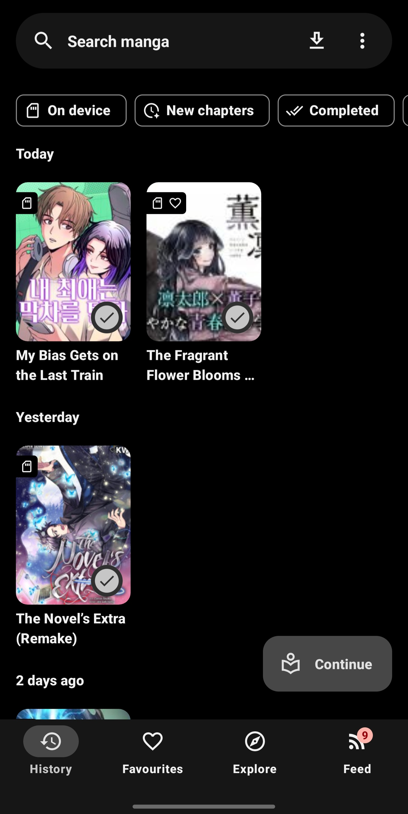
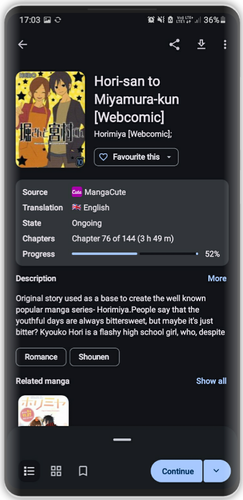
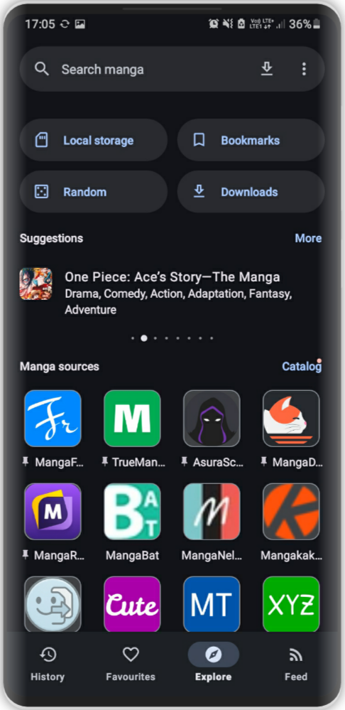
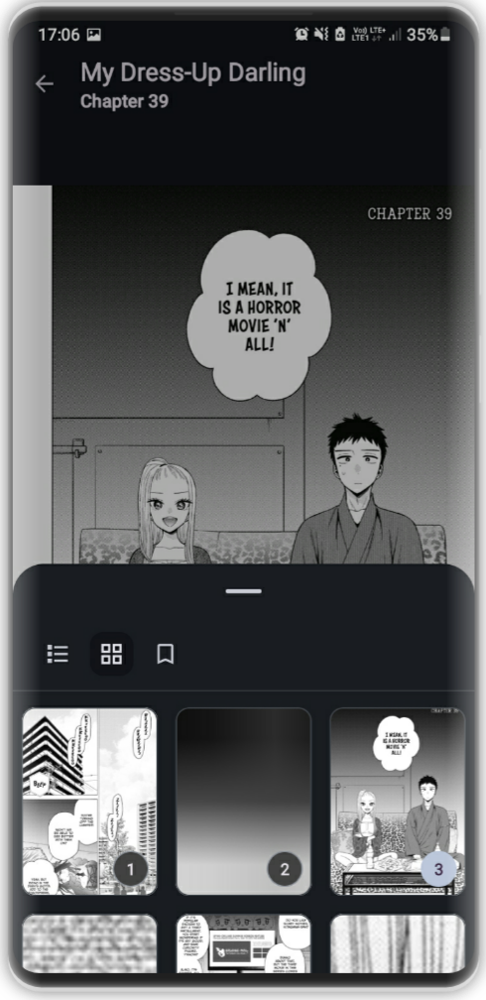
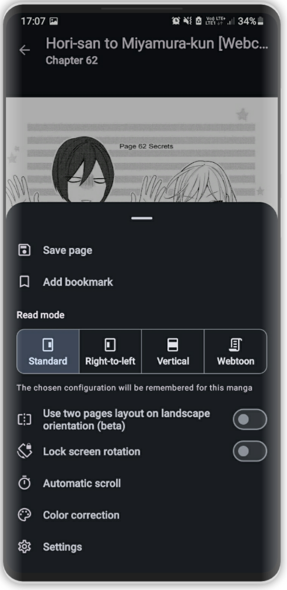
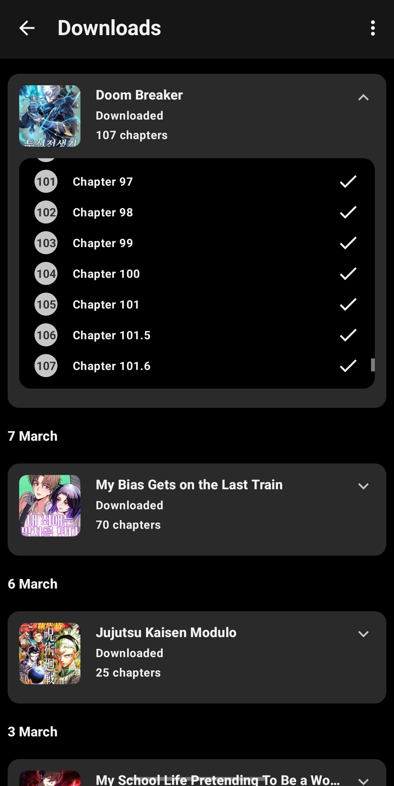
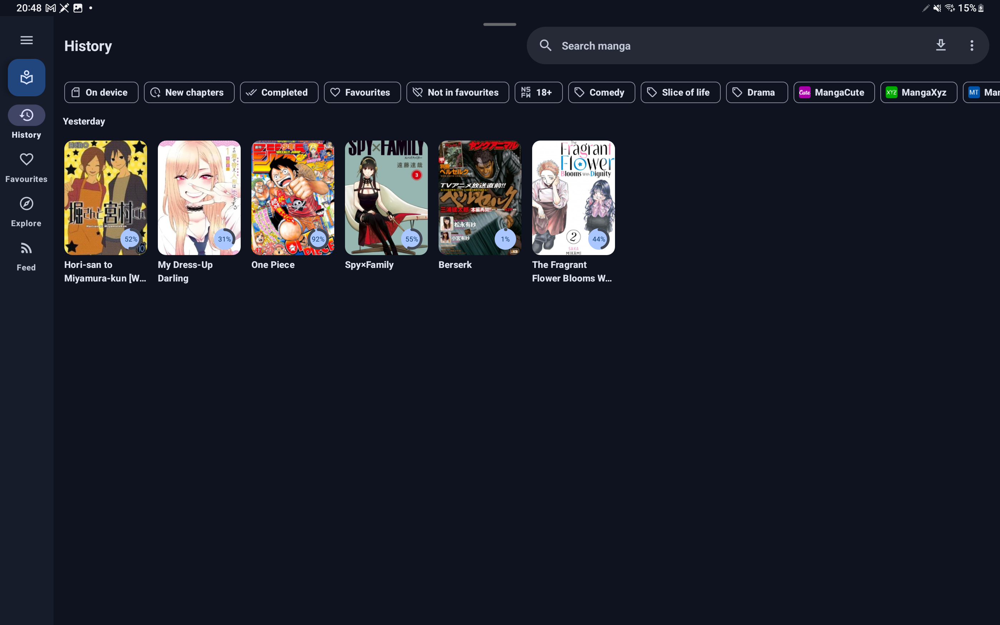
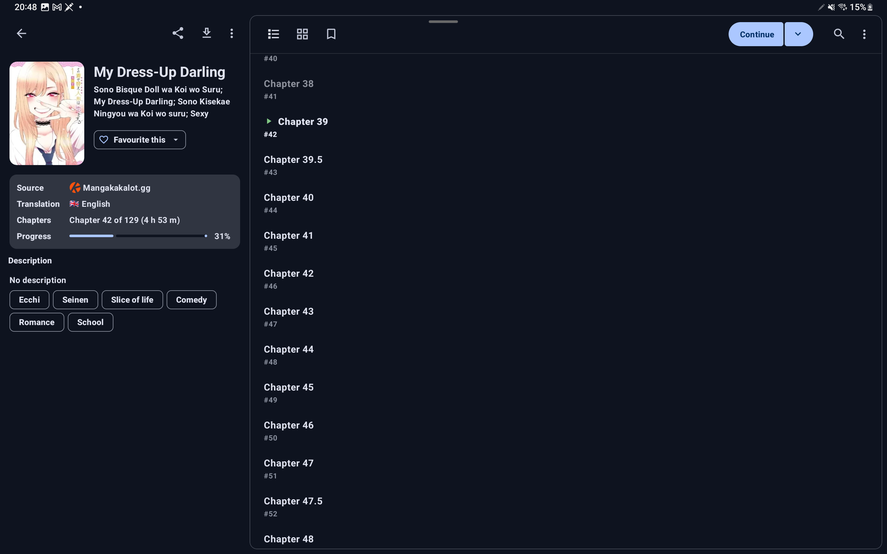

> [!NOTE]
> **Futon is a fork of [Kotatsu](https://github.com/KotatsuApp/Kotatsu)** — a free and open-source manga reader for Android.
> 
> This fork continues development and maintenance of the manga reader, building upon the excellent foundation created by the Kotatsu team.

---

<div align="center">

**Futon is a free and open-source manga reader for Android with built-in online content sources.**

 [](https://github.com/AppFuton/futon-parsers) [](https://github.com/AppFuton/Futon/blob/devel/LICENSE)[](https://apt.izzysoft.de/packages/io.github.landwarderer.futon)


### Main Features

<div align="left">

* Online [manga catalogues](https://github.com/AppFuton/futon-parsers) (with 1200+ manga sources)
* Search manga by name, genres and more filters
* Favorites organized by user-defined categories
* Reading history, bookmarks and incognito mode support
* Download manga and read it offline. Third-party CBZ archives are also supported
* Clean and convenient Material You UI, optimized for phones, tablets and desktop
* Standard and Webtoon-optimized customizable reader, gesture support on reading interface
* Notifications about new chapters with updates feed, manga recommendations (with filters)
* Integration with manga tracking services: Shikimori, AniList, MyAnimeList, Kitsu
* Password / fingerprint-protected access to the app
* Automatically sync app data with other devices on the same account
* Support for older devices running Android 6.0+

</div>

### In-App Screenshots

<div align="center">
    
    
    
    
    
    
</div>

<br>

<div align="center">
    
    
</div>

### Downloads

[](https://apt.izzysoft.de/packages/io.github.landwarderer.futon)

### Contributing

<br>

**📌 Pull requests are welcome. See [CONTRIBUTING.md](./CONTRIBUTING.md) for guidelines.**

### Certificate fingerprints

```plaintext
BB:1C:14:0D:E0:07:78:59:1F:93:D2:FB:43:AC:B3:5A:BA:86:71:3A:20:8F:6F:1A:D4:2D:29:EC:7D:3A:CD:C5
```

### License

[](http://www.gnu.org/licenses/gpl-3.0.en.html)

<div align="left">

You may copy, distribute and modify the software as long as you track changes/dates in source files. Any modifications
to or software including (via compiler) GPL-licensed code must also be made available under the GPL along with build &
install instructions.

</div>

### DMCA disclaimer

<div align="left">

The developers of this application do not have any affiliation with the content available in the app and does not store
or distribute any content. This application should be considered a web browser, all content that can be found using this
application is freely available on the Internet. All DMCA takedown requests should be sent to the owners of the website
where the content is hosted.

</div>

---

### Acknowledgments

<div align="left">

**Futon is built upon the exceptional work of the [Kotatsu](https://github.com/KotatsuApp/Kotatsu) project.**

We are deeply grateful to:

* **The original Kotatsu developers** for creating such an outstanding manga reader and making it open source
* **The Kotatsu community** for their contributions, testing, and support
* **All translators** who helped localize Kotatsu through [Weblate](https://hosted.weblate.org/engage/kotatsu/)
* **Parser contributors** who maintain the extensive library of [manga sources](https://github.com/AppFuton/futon-parsers)

This project stands on the shoulders of giants. The Kotatsu team's dedication to creating a feature-rich, user-friendly manga reader has provided an incredible foundation for Futon to build upon.

**Thank you to everyone who contributed to Kotatsu — your work continues to benefit the manga reading community!**

For the original Kotatsu project, please visit: [github.com/KotatsuApp/Kotatsu](https://github.com/KotatsuApp/Kotatsu)

</div>
