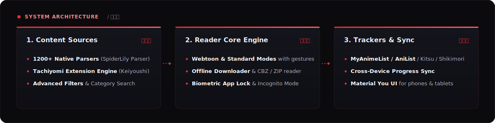

<p align="center">
  
</p>

<p align="center">
  <a href="https://github.com/GopikChenth/SpiderLily_Parser"></a>
  <a href="https://github.com/keiyoushi/extensions"></a>
  <a href="https://github.com/AppFuton/Futon/blob/devel/LICENSE"></a>
  <a href="https://apt.izzysoft.de/packages/com.arcadelabs.spiderlily"></a>
  <a href="https://discord.gg/9sqBHXhwzz"></a>
</p>

---

### 🌸 Overview / 概要

**Spider Lily** (蜘蛛百合) is a lightweight, privacy-focused, open-source manga reader for Android. Built with Kotlin and Jetpack Compose, it brings together **1,200+ native manga catalogues** alongside support for **Tachiyomi / Keiyoushi extensions**, providing an ad-free and continuous reading experience.

---

### ⛩️ Architecture & Core Capabilities / 構造と機能

<p align="center">
  
</p>

| Feature Area | Key Capabilities |
| :--- | :--- |
| **🌐 Catalogues & Sources** | 1,200+ online manga sources, Tachiyomi extension compatibility, genre/tag filters, and global catalog search. |
| **📖 Reading Experience** | Standard single/double page modes, Webtoon continuous vertical scroll, gesture controls, and color adjustments. |
| **📥 Local & Offline** | High-speed chapter downloader for offline reading, plus native support for opening external `.cbz` / `.zip` files. |
| **📊 Tracker Sync** | Auto-sync reading progress with **MyAnimeList**, **AniList**, **Kitsu**, and **Shikimori**. |
| **🔒 Security & Privacy** | Incognito reading mode, fingerprint / biometric authentication, and local data isolation. |
| **☁️ Device Sync** | Cross-device data synchronization for category management, favorites, and reading history. |

---

### 📥 Download & Installation / 入手方法

Choose your preferred distribution channel to install Spider Lily:

- **[IzzyOnDroid Repository](https://apt.izzysoft.de/packages/com.arcadelabs.spiderlily)** — Verified automated builds & updates.
- **[F-Droid Repository](https://f-droid.org/packages/com.arcadelabs.spiderlily)** — Official F-Droid package build.
- **[GitHub Releases](https://github.com/AppFuton/Futon/releases/latest)** — Download the latest direct `.apk` binaries (`app-release.apk`).

---

### 🛠️ Development & Building / 開発環境

#### Prerequisites
- **JDK 17** (Recommended: [Adoptium Temurin 17](https://adoptium.net/temurin/releases/))
- **Android SDK** (Compile SDK 36, Target SDK 36, Minimum SDK 23 / Android 6.0+)
- **Android Studio** (Recommended) or Gradle CLI

#### Build Commands

```bash
# Clone repository
git clone https://github.com/AppFuton/Futon.git
cd Futon

# Build Debug APK (Local Testing)
./gradlew assembleDebug

# Build Release APK
./gradlew assembleRelease

# Build Nightly Variant
./gradlew assembleNightly
```

#### Running Tests & Code Quality

```bash
# Run unit tests
./gradlew test

# Run instrumented UI & DB tests (Device/Emulator)
./gradlew connectedDebugAndroidTest

# Run code style & lint inspection
./gradlew check
```

---

### 🌐 Localization & Community / 翻訳・コミュニティ

Help translate Spider Lily into your language on **[Weblate](https://hosted.weblate.org/engage/futon/)**.

Have questions, feature proposals, or issues? Connect with developers and users on our **[Discord Community](https://discord.gg/9sqBHXhwzz)**.

---

### 🔑 Security & Certificate / 署名

```plaintext
SHA-256 Fingerprint:
EF:48:B2:2E:F2:C5:40:45:53:1F:6E:76:00:C2:7E:C3:D0:3B:71:22:1E:0B:05:FF:B6:8E:33:57:CF:8E:4D:40
```

---

### 📄 DMCA Disclaimer & License / 免責事項・ライセンス

* **DMCA Notice:** The developers of Spider Lily do not host, store, or distribute any copyrighted media content. Spider Lily acts solely as an open client interface for freely available public content on the internet.
* **License:** Distributed under the **GNU General Public License v3.0 (GPLv3)**. See [LICENSE](./LICENSE) for terms.

---

### 💖 Acknowledgments / 謝辞

Spider Lily builds upon the exceptional open-source work of the **[Kotatsu](https://github.com/KotatsuApp/Kotatsu)** project. Special thanks to:
* The original **Kotatsu** project maintainers & community
* The **SpiderLily Parser** maintainers ([GopikChenth/SpiderLily_Parser](https://github.com/GopikChenth/SpiderLily_Parser))
* The **Keiyoushi** extension ecosystem developers
* All open-source translators and contributors
